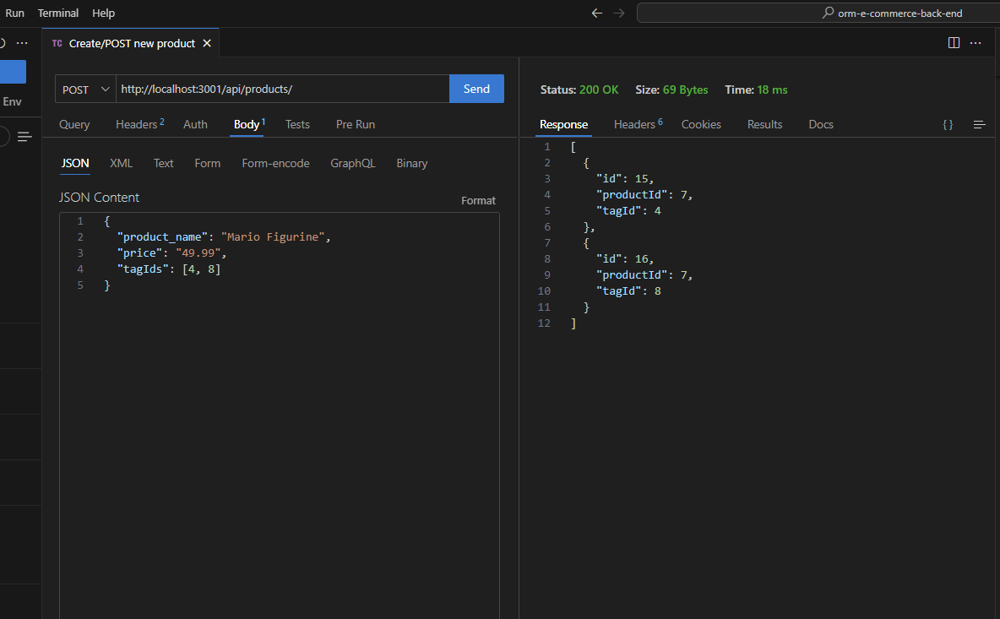
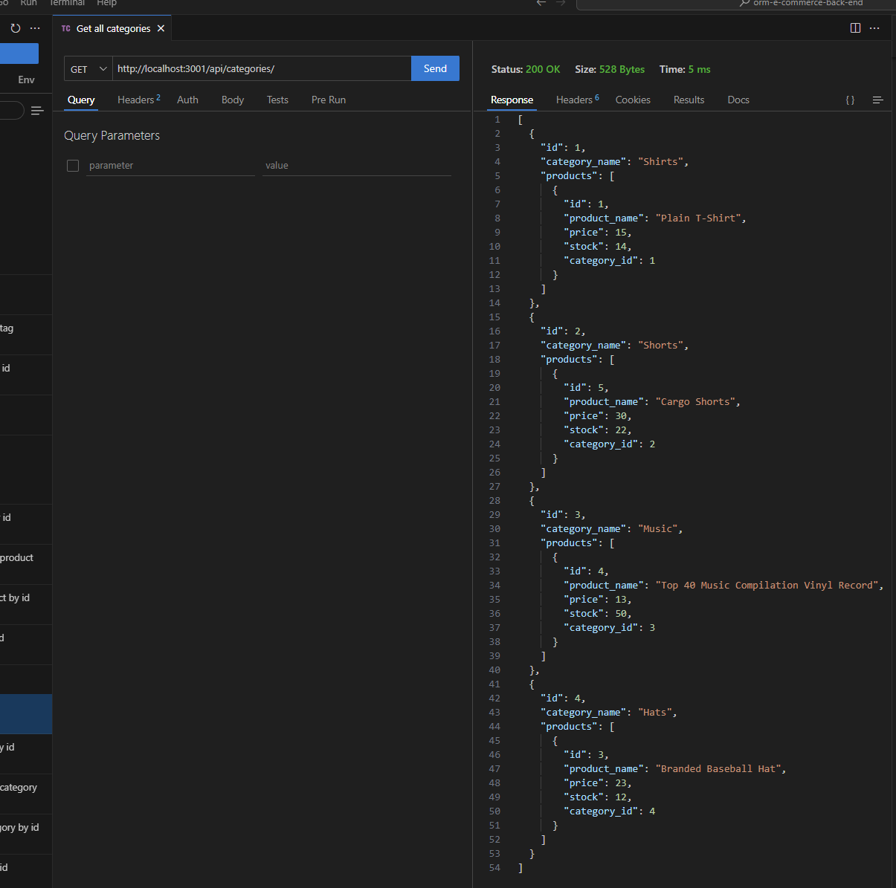

# Module Thirteen Challenge: ORM Back End

## Description
Our task is to set up the back end for an e-commerce site making primary use of [Sequelize](https://sequelize.org/), an ORM tool for (in our case) MySQL. We will be responsible for the setup of the database and associated seed data, setting up the connection between the database and Sequelize, and setting up routes.

## Acceptance Criteria

```md
GIVEN a functional Express.js API:

WHEN I add my database name, MySQL username, and MySQL password to an environment variable file
THEN I am able to connect to a database using Sequelize

WHEN I enter schema and seed commands
THEN a development database is created and is seeded with test data

WHEN I enter the command to invoke the application
THEN my server is started and the Sequelize models are synced to the MySQL database

WHEN I open API GET routes in Insomnia for categories, products, or tags
THEN the data for each of these routes is displayed in a formatted JSON

WHEN I test API POST, PUT, and DELETE routes in Insomnia
THEN I am able to successfully create, update, and delete data in my database
```

## Mock-Up

The following is a link to a video walkthrough of the setup and route testing using Thunder Client:

https://youtu.be/OKmNc95xtRM

Screenshots of route testing using [Thunder Client](https://www.thunderclient.com/):





## Installation
1) `npm i` or `npm install` to download dependencies.
3) A .envEXAMPLE is provided. From it you can create your own .env file to store environment variables needed to connect to the database.
3) use the MySQL shell to create the database or use the provided `dbInit.js` file and its associated npm script `npm run db`.
4) `npm start` is a script to start the server.

## Credits

Sequelize Documentation:

https://sequelize.org/docs/v6/

Phind for debugging:

https://www.phind.com/